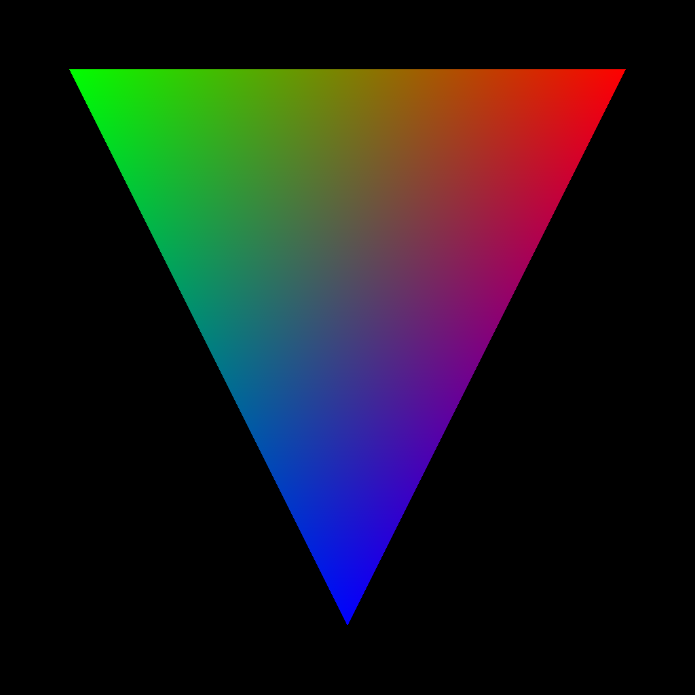
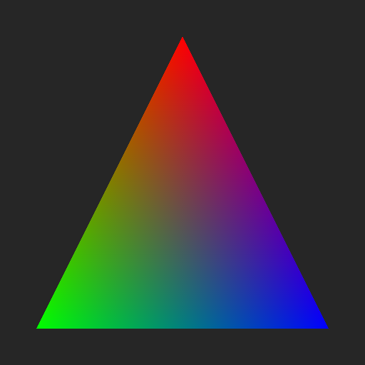

# metal-ai-skill

A [Claude Code skill](https://docs.anthropic.com/en/docs/claude-code/skills) for GPU debugging and profiling on Apple's Metal ecosystem.

This is the Metal counterpart to [renderdoc-skill](https://github.com/rudybear/renderdoc-skill). While renderdoc-skill provides GPU debugging for Vulkan/D3D/GL via RenderDoc's `rdc-cli`, metal-ai-skill provides GPU profiling, validation, and shader analysis for Metal apps on macOS via Apple's native toolchain.

[](https://www.youtube.com/watch?v=ov_v3b5gNCE)

## What It Does

Teaches Claude Code how to:

- **Profile** Metal GPU performance using `xctrace` (Metal System Trace) on macOS and iOS devices
- **Export** GPU profiling data as parseable XML (driver events, counters, timelines)
- **Validate** Metal API usage and shader execution with validation layers
- **Monitor** real-time GPU performance via Metal Performance HUD
- **Compile** and validate Metal shaders from the command line
- **Capture** Metal frames to `.gputrace` for Xcode debugging
- **Debug** Vulkan apps on macOS via MoltenVK

## Quick Setup

### 1. Prerequisites

- macOS with Metal-capable GPU (Apple Silicon or AMD)
- **Full Xcode** installed (not just Command Line Tools)
- For Vulkan apps: MoltenVK
- For iOS profiling: physical device connected via USB, device trusted

Verify your setup:

```bash
xcode-select -p                     # Should show Xcode.app path
xcrun xctrace version               # Should print version
xcrun -sdk macosx metal --version   # Should print Metal compiler version
```

### 2. Install the Skill

Copy the `.claude/` directory into your project root:

```bash
# Clone
git clone https://github.com/rudybear/metal-ai-skill.git

# Copy skill into your project
cp -r metal-ai-skill/.claude /path/to/your/project/
```

Or add as a git submodule:

```bash
cd /path/to/your/project
git submodule add https://github.com/rudybear/metal-ai-skill.git .metal-ai
cp -r .metal-ai/.claude .
```

### 3. Customize CLAUDE.md

Edit `CLAUDE.md` in your project root with your app-specific details (executable path, shader locations, debug markers).

## MCP Server (Alternative)

Instead of the Claude Code skill, you can use the MCP server for structured tool access:

```bash
pip install -r requirements-mcp.txt
claude mcp add metal-tools -- python /path/to/metal-ai-skill/mcp_server/server.py
```

This registers 9 tools (`metal_doctor`, `metal_trace`, `metal_parse_trace`, `metal_capture`, `metal_shader`, `metal_validate`, `metal_hud`, `metal_screenshot`, `metal_command`), 2 resources (`metal://traces`, `metal://captures`), and 7 debugging prompts.

## Usage

Once installed, Claude Code will automatically use this skill when you ask about Metal GPU debugging. Example prompts:

- *"Profile my Metal app for 10 seconds and show me what's slow"*
- *"Check this shader for compilation errors"*
- *"Run my app with Metal validation and show me any API errors"*
- *"Capture a frame of my Vulkan app on macOS for debugging"*
- *"Compare GPU performance before and after my shader change"*
- *"Monitor real-time FPS and GPU time while I test"*

## Architecture

```
metal-ai-skill/
├── .claude/
│   └── skills/
│       └── metal-gpu-debug/
│           ├── SKILL.md                          # Main skill definition
│           └── references/
│               ├── xctrace-quick-ref.md          # xctrace command reference
│               └── debugging-recipes.md          # Extended debugging workflows
├── mcp_server/                                   # MCP server (alternative integration)
│   ├── __init__.py
│   ├── server.py                                 # FastMCP server — 9 tools, 2 resources, 7 prompts
│   ├── metal_runner.py                           # Async subprocess wrapper
│   └── recipes.py                                # Debugging recipe strings for prompts
├── examples/
│   ├── buggy-renderer/                           # 10-bug compute shader demo
│   │   ├── main.swift                            # Headless particle simulation
│   │   ├── Shaders.metal                         # 5 shader bugs + 5 host bugs
│   │   └── build_and_run.sh
│   └── visual-demo/                              # 4-bug rendering demo
│       ├── main.swift                            # Windowed cube renderer with geometry bug
│       ├── Shaders.metal                         # 3 shader bugs (BGR, Y-flip, alpha=0)
│       └── build_and_run.sh
├── CLAUDE.md                                     # Project context for Claude Code
├── capture_frame.swift                           # Example: programmatic frame capture
├── parse_trace.py                                # Parse xctrace XML exports to TSV/JSON/CSV
├── parse_gputrace.py                             # Inspect .gputrace buffer/texture data from CLI
├── requirements-mcp.txt                          # MCP server dependencies
├── LICENSE
└── README.md
```

## Key Differences from renderdoc-skill

| Feature | renderdoc-skill | metal-ai-skill |
|---------|----------------|-------------------|
| **Primary tool** | `rdc-cli` (66 commands) | `xctrace` + env vars + `xcrun metal` |
| **APIs** | Vulkan, D3D11/12, OpenGL | Metal (+ Vulkan via MoltenVK) |
| **Platform** | Windows, Linux, Android | macOS, iOS/iPadOS (via USB) |
| **Capture format** | `.rdc` (full CLI access) | `.gputrace` (Xcode GUI + CLI buffer inspection) |
| **CLI inspection** | Full (draws, pipeline, pixels, shaders) | Profiling + validation + buffer data (via labels) |
| **Shader debugging** | Step-through from CLI | Compile-time validation only (runtime in Xcode) |
| **GPU profiling** | GPU counters (limited) | Full xctrace + Metal Counters API |
| **Validation** | API validation flag | API + Shader validation layers |
| **Performance HUD** | N/A | Built-in MTL_HUD_ENABLED |

The fundamental difference: RenderDoc gives you full post-mortem capture inspection from CLI. Metal's tooling splits between CLI (profiling, validation, shader compilation) and Xcode GUI (draw call stepping, shader debugging, pixel history). This skill uses an autonomous debugging workflow that gathers signal from multiple sources in parallel (screenshots, .gputrace, shader compilation, source code) and falls back gracefully when buffer data isn't available from programmatic captures.

## Examples

### Profile GPU performance

```bash
# Claude Code will run:
xcrun xctrace record --template 'Metal System Trace' --time-limit 10s \
  --output traces/profile.trace --launch -- ./MyApp
xcrun xctrace export --input traces/profile.trace --toc
xcrun xctrace export --input traces/profile.trace --output traces/analysis/events.xml \
  --xpath '/trace-toc/run[@number="1"]/data/table[@schema="metal-driver-event-intervals"]'
```

### Validate Metal API usage

```bash
# Claude Code will run:
MTL_DEBUG_LAYER=1 MTL_SHADER_VALIDATION=1 ./MyApp 2>&1 | tee validation.log
```

### Compile and check shaders

```bash
# Claude Code will run:
xcrun -sdk macosx metal -c -Weverything -Werror Shaders.metal -o /dev/null
```

### Inspect buffer data from .gputrace captures

```bash
# Claude Code captures a frame, then reads buffer contents by label:
METAL_CAPTURE_ENABLED=1 ./MyApp

python3 parse_gputrace.py capture.gputrace
# Resources:
#   MTLBuffer-10-0   491,520 bytes  → Particle Buffer
#   MTLBuffer-14-0   163,840 bytes  → Color Output Buffer

python3 parse_gputrace.py capture.gputrace --buffer "Color Output" --layout float4 --index 100
# [100] (0.5909, 0.7278, 0.5450, 1.0000)
```

## Visual Demo

The `examples/visual-demo/` contains a broken Metal cube renderer with **4 intentional bugs** that produce visibly wrong output. It demonstrates Claude Code's autonomous debugging workflow — screenshot, .gputrace capture, shader compilation, source code analysis, and fix/verify loop.

**Before (buggy)** — distorted geometry, flipped, wrong colors:



**How Claude fixes it:**

```bash
cd examples/visual-demo
./build_and_run.sh --screenshot  # Render + save output.png

# Claude gathers signal in parallel:
#   A. Reads output.png — sees distorted, wrong-colored cube
#   B. Captures .gputrace — lists resources and shader functions
#   C. Compiles shaders with -Weverything
#   D. Reads source code (.metal + Swift)

# Claude diagnoses 4 bugs:
#   Bug 1: Front face vertices collapsed to (0,0,s) instead of (s,s,s)
#   Bug 2: Y axis flipped after MVP (out.position.y *= -1.0)
#   Bug 3: R/B channels swapped in fragment shader
#   Bug 4: Alpha multiplied by 0.0 (transparent)

# Claude fixes all 4, rebuilds, verifies output.png is correct
```

**After (fixed)** — properly oriented cube with correct face colors:



See also `examples/buggy-renderer/` for a more complex 10-bug compute shader demo.

## License

MIT — see [LICENSE](LICENSE).

## Related Projects

- [renderdoc-skill](https://github.com/rudybear/renderdoc-skill) — RenderDoc GPU debugging skill for Vulkan/D3D/GL
- [RenderDoc](https://github.com/baldurk/renderdoc) — The underlying graphics debugger
- [MoltenVK](https://github.com/KhronosGroup/MoltenVK) — Vulkan to Metal translation layer
